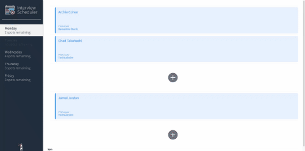

# Interview Scheduler

## Description

This is a full-stack React app built to simulate an app that companies could use to quickly book and keep track of the employee interviews they have coming up and who will be interviewing who.


### Selecting a Timeslot
Users can select from the available days to book interviews. Once a day is selected the the interviews and avaialble timeslots for that day will be displayed. If a day has been fully booked it will be greyed out
in the sidebar and a warning of "no spots remaining" will be displayed.


### Booking A Interview
Users can book from the available time slots and must input interviewe's name and select the interviewer. When the user clicks save their time slot will be allocated and the number of spots remaining will decrease appropriately.




### Editing A Interview
Already booked interviews can be edited allowing for the name of the interviewe to be changed or the swapping out of interviewers.


### Canceling A Interview
Already booked interviews can also be canceled should the employer wish to do so. Upon pressing the delete button a confirmation will be displayed and if confirmed the booked interview will be deleted freeing up that timeslot and incrementing the number of slots appropriately.


## Setup

1. Install dependencies with `npm install`.

2. Clone and run the test server from https://github.com/lighthouse-labs/scheduler-api

3. Run the app  npm start

4. App will run on localhost:8000


## Testing

### Running Jest Test Suites

```sh
npm test
```

### Running Cypress Integration Tests

1. Run the server in test mode
 ```sh
npm run test:server
```

2. Run the test suites
```sh
npm run cypress
```

### Running Storybook Visual Testbed

```sh
npm run storybook
```

